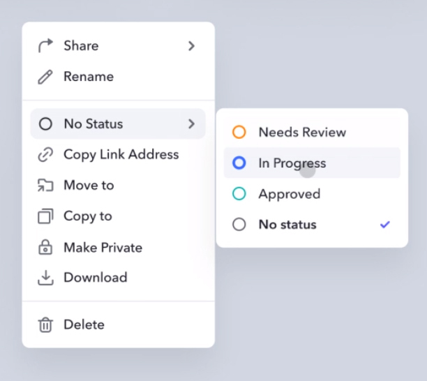
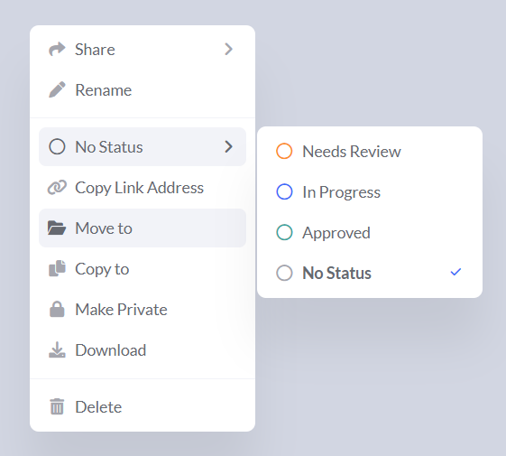

# Menu Transformation

This is my attempt at transforming a given picture into code.

## Table of contents

-  [Overview](#overview)
   -  [The challenge](#the-challenge)
   -  [Original image](#original-image)
   -  [Solution screenshot](#solution-screenshot)
   -  [Links](#links)
-  [My process](#my-process)
   -  [Built with](#built-with)
   -  [What I learned](#what-i-learned)
-  [Author](#author)

## Overview

### The challenge

Change the given picture into similar-looking webpage using HTML and CSS. For the challenge to be complete the functionality of the menu is not needed.

### Original image

### Solution screenshot

### Links

-  Live Site URL: [https://majdrab.github.io/menu-transformation/](https://majdrab.github.io/menu-transformation/)

## My process

### Built with

-  HTML
-  CSS

### What I learned

Just refreshing my CSS knowledge.

## Author

-  Website - [Maj Drab](https://majdrab.github.io/)
